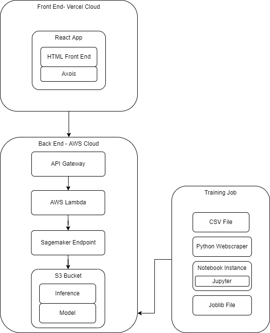
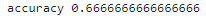
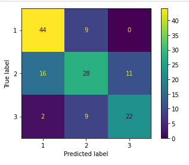

# JudgeTrack---Master
All Individual JudgeTrack Projects merged

# Project Overview
In public forum debate, each judge has a "paradigm" which describes how a person views debate, and will judge the round.
 
Generally in debate, judges are categorized into 3 categories:
 
  'lay': new to debate
   
  'flay': more experienced
   
  'tech': very experienced
   
 
This project has 3 components:
 
a) a webscraper to gather all the judges at a given tournament
 
b) a machine learning text classificaiton model, that will interpret a judges paradigm and give a classification of lay, flay, tech
 
c) a react front end to enter a paradigm, and display the result
 

all of this is deployed on the cloud, all the machine learning and API gateway is done on AWS, while the front end is hosted on Vercel

Look at the **JudgeTrack Diagram** for a more indepth orginization, and design of how all of this was implementedd

Specific details for each part of the project can be found in the README file of each mini-repo
# JudgeTrack Diagram

# Model Accuracy
Yes, this model isn't that accuracte, but given this is text classification model, trained on only 300 data entries which had to be manually entered it's actually pretty accurate.
 
A potential downside, is since the data set wasn't equally distributed among the 3 categories of judges, the model will have a bias towards the category 1, corresponding to lay judge
 
 

 

